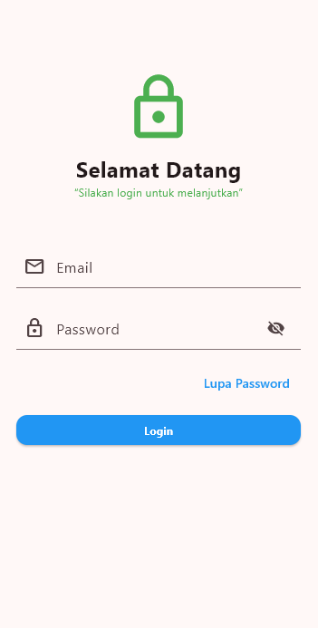

## Screenshot



Nama: Dimas Prasetyo
Nim: 1123150165

Cara Menjalankan Project

1. Clone atau download repository project ini:
   ```bash
   git clone https://github.com/GAJAHGAJAH/KB1179-1123150165-uts
   cd KB1179-1123150165-uts
   ````

2. Install semua dependency:

   ```bash
   flutter pub get
   ```

3. Jalankan project di device atau emulator:

   ```bash
   flutter run
   ```


